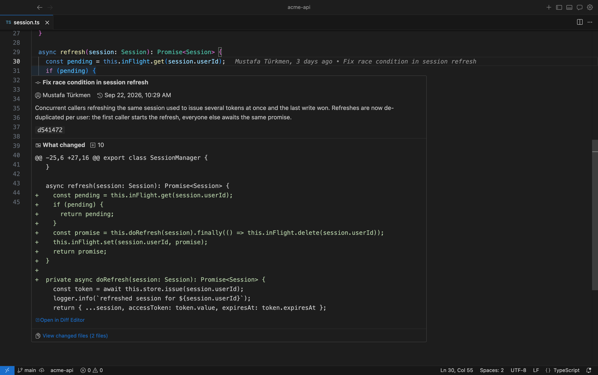
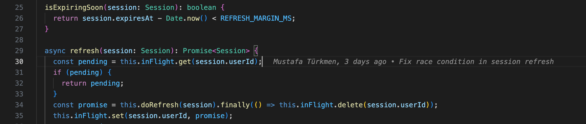
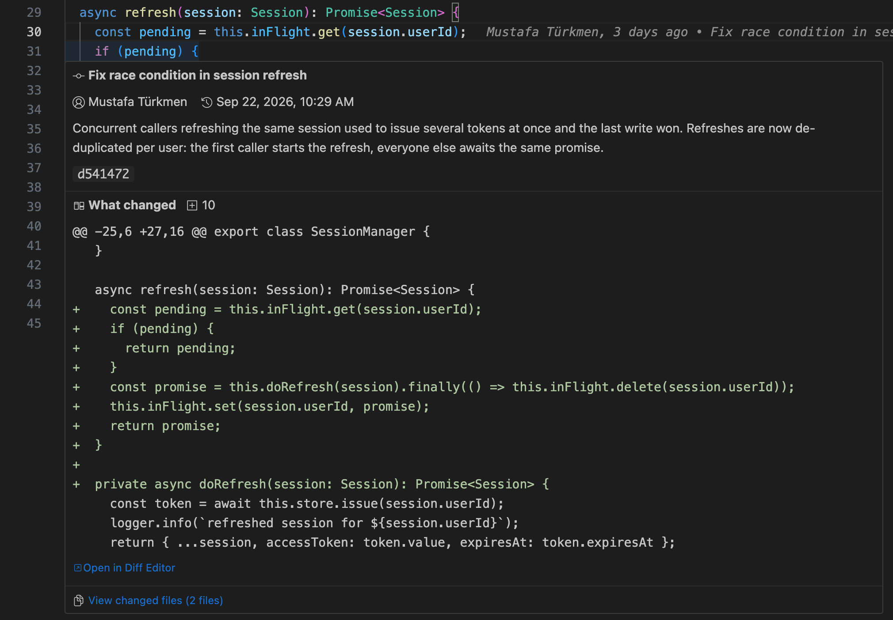
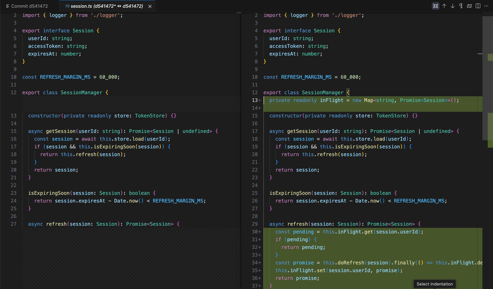
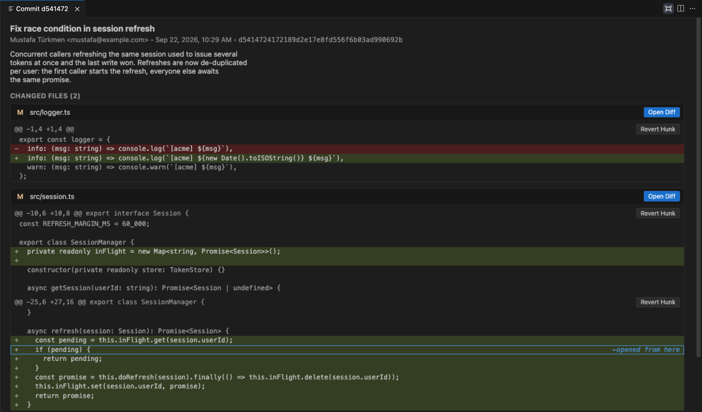
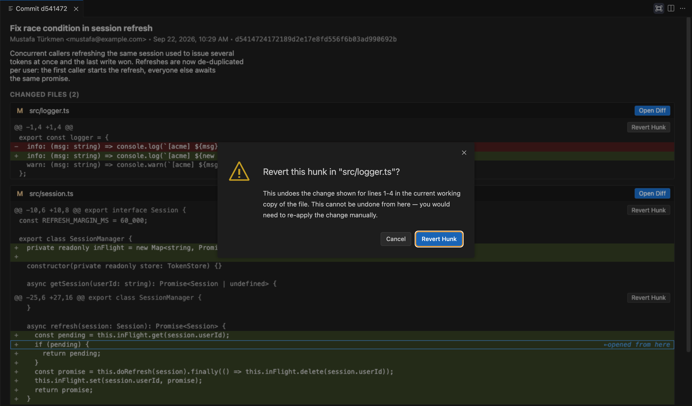

# Git Blame Solo

[](https://github.com/SeniorTurkmen/gitblamesolo-extension/actions/workflows/ci.yml)
[](LICENSE)
[](https://code.visualstudio.com/)
[](#contributing)

**Git Blame Solo answers "who changed this line, when, and why?" without making you leave the editor.**

Move your cursor to any line and a quiet annotation at the end of it shows the author, how long ago it changed, and the commit message. Hover the line to see the full commit and the exact change it introduced. One more click gives you every file in that commit with colored diffs, and you can revert a single hunk from there if you need to.

It does one thing, stays out of the way, and has no dependencies beyond the `git` you already have installed.



---

## Table of contents

- [Features](#features)
  - [Inline blame on the current line](#inline-blame-on-the-current-line)
  - [Uncommitted changes, even before you save](#uncommitted-changes-even-before-you-save)
  - [Rich hover: the commit and what it changed](#rich-hover-the-commit-and-what-it-changed)
  - [Native diff editor](#native-diff-editor)
  - [Commit details panel](#commit-details-panel)
  - [Revert a single hunk](#revert-a-single-hunk)
  - [Commands](#commands)
- [Requirements](#requirements)
- [Settings](#settings)
- [Known limitations](#known-limitations)
- [Development](#development)
- [Contributing](#contributing)
- [License](#license)

---

## Features

### Inline blame on the current line

As your cursor moves, a faded annotation appears at the end of the active line:

```
Jane Doe, 3 days ago • Fix race condition in session refresh
```

- Only the **active line** is annotated, so the rest of your code stays uncluttered.
- Recomputation is **debounced** (150 ms by default), so scrolling or holding an arrow key doesn't spawn a flood of `git` processes.
- Results are **cached per document**, so moving back to a line you already visited is instant.
- The format is fully customizable through a template. See [`gitBlameSolo.decorationTemplate`](#settings).



### Uncommitted changes, even before you save

When a line hasn't been committed yet, the annotation says **"Uncommitted changes"** along with when the file was last modified.

Blame is computed against the **live editor buffer**: the extension pipes the buffer's contents to `git blame --contents -`. Lines you just typed are flagged correctly **before you save**, and line numbers never drift out of sync with what's on disk.


### Rich hover: the commit and what it changed

Hover any line (not just the active one) to open a popup containing:

| Section | What you see |
| --- | --- |
| **Header** | Commit subject, author, absolute date, and short hash |
| **Body** | The full commit message body, if there is one |
| **What changed** | A colored `diff` of the **entire changed block** the line belongs to (every contiguous line changed in the same hunk, not only the hovered line), with an added/removed line count |
| **Actions** | **Open in Diff Editor** and **View changed files (N files)** |

This shows you the context of a change right away: you see the rest of the block that changed with the line, not just the one line in isolation.



### Native diff editor

**Open in Diff Editor** in the hover opens the file in VS Code's built-in side-by-side diff editor, comparing the commit (`<sha>`) against its parent (`<sha>^`). Syntax highlighting, inline/side-by-side toggling, and navigating between changes all work as usual.



### Commit details panel

**View changed files** in the hover (or the **Git Blame Solo: Show Commit Details** command) opens a panel with the whole commit:

- The commit message, author, date, and hash at the top.
- **Every file the commit touched**, each with its **full colored diff**. Added and removed lines are clearly marked.
- Click a **file header** to open that file in the editor.
- The **Open Diff** button opens that file's change in the native diff editor.
- **The line you started from is highlighted** inside its file's diff, so you don't lose your place in a large commit. Clicking the highlighted line takes you back to that spot in the editor.



### Revert a single hunk

Each hunk in the panel has a **Revert Hunk** button. It undoes **only that hunk** in your working copy using `git apply --reverse` and leaves the rest of the commit alone.

Several safeguards are built in:

1. **Unsaved changes block the revert.** If the file has unsaved edits, you're asked to save or discard them first.
2. **Always asks first.** A modal dialog shows exactly which lines will be affected before anything changes.
3. **Fails safely.** If the file has changed since that commit and the hunk no longer applies cleanly, the file is **left untouched** and you get a clear error message.

After a successful revert, the button changes to **Reverted**, and a notification offers to open the file.



### Commands

Open the Command Palette (<kbd>Cmd</kbd>/<kbd>Ctrl</kbd>+<kbd>Shift</kbd>+<kbd>P</kbd>) and type **Git Blame Solo**:

| Command | Description |
| --- | --- |
| `Git Blame Solo: Toggle Inline Blame` | Turns the end-of-line annotation on or off (saved to your user settings). |
| `Git Blame Solo: Show Commit Details` | Opens the commit details panel for the line under the cursor. Also available from the editor's right-click menu. |
| `Git Blame Solo: Copy Commit Hash` | Copies the full hash of the commit that last changed the current line to the clipboard. |

---

## Requirements

- VS Code **1.90** or later.
- `git` available on your `PATH`. If it isn't, the extension shows a one-time warning and turns off blame and hover.
- The file must be inside a git repository. Files outside a repository are ignored.

## Settings

| Setting | Default | Description |
| --- | --- | --- |
| `gitBlameSolo.enabled` | `true` | Show the inline blame annotation for the current line. |
| `gitBlameSolo.dateStyle` | `"relative"` | `"relative"` (e.g. *3 days ago*) or `"absolute"` date formatting in the annotation and hover. |
| `gitBlameSolo.decorationTemplate` | `"${author}, ${date} • ${message}"` | Template for the inline annotation. Placeholders: `${author}` `${date}` `${message}` `${hash}`. |
| `gitBlameSolo.decorationColor` | `""` | Theme color id (e.g. `editorLineNumber.foreground`) or hex color (e.g. `#888888`). Empty uses `editorCodeLens.foreground`. |
| `gitBlameSolo.debounceMs` | `150` | Milliseconds to wait after the cursor stops moving before recomputing blame. |
| `gitBlameSolo.hover.enabled` | `true` | Show full commit details on hover. |
| `gitBlameSolo.maxFileSizeKB` | `5000` | Files larger than this are skipped for performance. |
| `gitBlameSolo.uncommittedLabel` | `"Uncommitted changes"` | Label shown for lines that haven't been committed yet. |

For example, to show the short hash first with an absolute date:

```jsonc
{
  "gitBlameSolo.decorationTemplate": "${hash} · ${author} · ${date}",
  "gitBlameSolo.dateStyle": "absolute"
}
```

## Known limitations

- The timestamp shown for uncommitted lines is the file's **last save time on disk** (`mtime`), not the time of each individual keystroke.
- Files larger than `gitBlameSolo.maxFileSizeKB` are skipped.
- Only local files (`file:` scheme) are supported. Virtual or remote file systems aren't blamed.

---

## Development

```bash
npm install
npm run watch     # esbuild watch mode
```

Press <kbd>F5</kbd> to launch the **Run Extension** configuration and try the extension in an Extension Development Host.

### Project layout

```
src/
├── extension.ts        # activation, command registration
├── config.ts           # typed access to gitBlameSolo.* settings
├── git/                # thin wrappers around the git CLI + output parsers
├── cache/              # per-document / per-commit caches
├── decorations/        # end-of-line annotation
├── hover/              # hover provider
├── webview/            # commit details panel
└── util/               # date formatting, diff rendering
```

### Testing

```bash
npm run typecheck   # full type-check via tsc --noEmit
npm run test:unit   # pure function tests (parsers, caches, date formatting)
npm test            # end-to-end integration tests in an Extension Development Host
```

### Packaging

```bash
npm run package
npx vsce package --no-dependencies
```

### Publishing to Open VSX

A published GitHub release runs [`.github/workflows/publish.yml`](.github/workflows/publish.yml), which publishes the extension with [trusted publishing](https://github.com/eclipse-openvsx/openvsx/blob/master/cli/README.md#trusted-publishing). No access token is stored in the repo.

Creating the `SeniorTurkmen` namespace makes you a contributor, not an owner. The [Trusted publishers](https://open-vsx.org/user-settings/trusted-publishers) page only lists namespaces you own, so it stays empty until ownership is granted.

Until then, publish with an access token:

1. Create a token at [Access tokens](https://open-vsx.org/user-settings/tokens).
2. Add it to this repo as the Actions secret `OVSX_PAT`.
3. Run **Publish to Open VSX** from the Actions tab. The workflow uses that secret when it is set.

After you [claim the namespace](https://github.com/EclipseFdn/open-vsx.org/issues/new/choose) and Eclipse grants it, the Trusted publishers page lists `SeniorTurkmen`. Add this repository there with workflow file `publish.yml` and no environment, then remove `OVSX_PAT`. Later releases publish with the workflow's OIDC token and no stored secret.

## Contributing

Contributions are welcome! Bug reports, feature requests, and pull requests are all appreciated.

Before opening a PR, please make sure these all pass:

```bash
npm run typecheck
npm run lint
npm run test:unit
```

If you're changing anything under `src/git/`, `src/cache/`, or `src/util/`, add or update a unit test alongside it. Those modules are plain Node/TypeScript with no `vscode` dependency, so they run instantly under `npm run test:unit`. Anything under `src/decorations/`, `src/hover/`, `src/webview/`, or `src/extension.ts` needs `vscode` and is covered by `npm test` (Extension Development Host) or manual testing via <kbd>F5</kbd>.

## License

[MIT](LICENSE)
